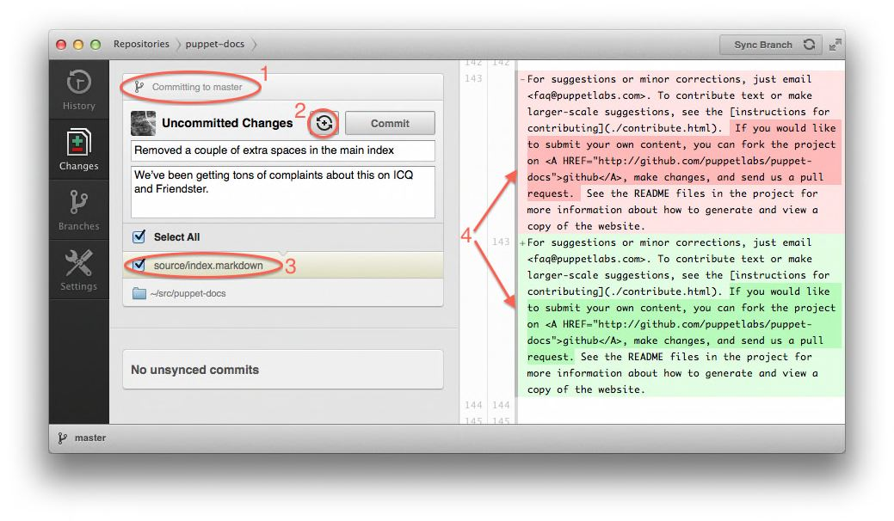
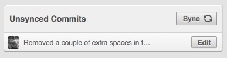
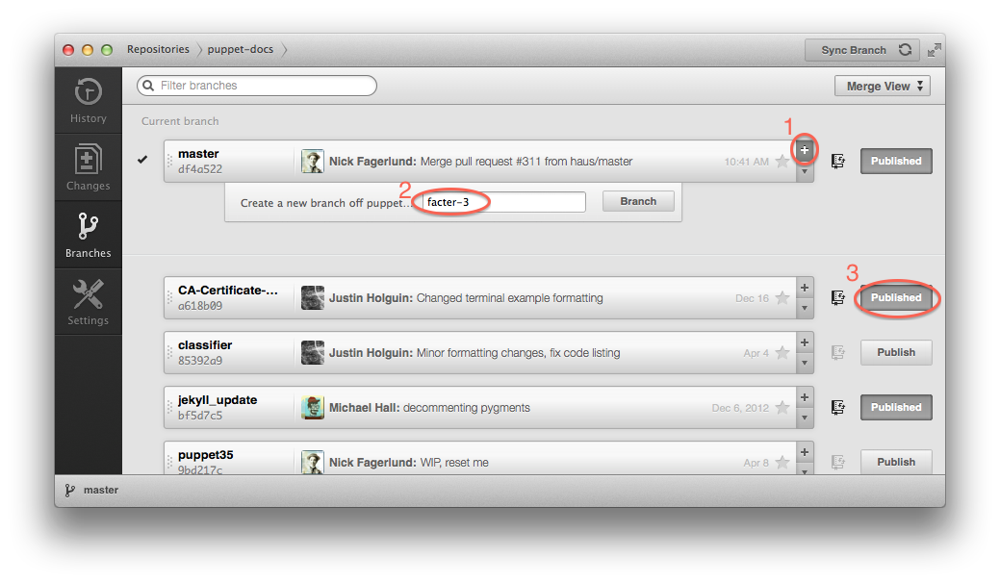

# GitHub App Quickstart

This document gives a quick tour of the [GitHub app](https://mac.github.com/release-notes.html) with the goal of quickly orienting people to the docs team's workflow. Even if you've never used git before, this guide should help you begin to make and publish changes to the site.

That said, this is not a replacement for [workflow guide](workflow.markdown), which provides a much more comprehensive look at the process. The GUI app may be fast and convenient, but it hides most of what's really going on and using it is counter-productive if you want to really learn git.

## Setup

Sign up for a [GitHub](https://www.github.com) account if you don't have one already, then download the [GitHub app](https://mac.github.com/release-notes.html) and install it.

Once you're logged in with the app, you can [click here to clone the puppetlabs/puppet-docs repo](github-mac://openRepo/https://github.com/puppetlabs/puppet-docs). Cloning it doesn't require any special permissions, but you'll need to talk to Ops and have them add you to our organization before you can publish your changes.

## A couple of concepts

### Distributed revision control

### Commits

"What happens next?"

## Making one-off changes

To illustrate the process of making small changes to the site, let's look at the example of correcting a typo. I've deleted a couple of extra spaces in `source/index.markdown` and saved the file, so now the GitHub app is showing this:

  1. This section shows the target branch for the commit. The `master` branch is the one from which the site is actually generated, so that's where we want to be right now.
  2. This is the "Commit & Sync" toggle. When it's on, hitting the commit button will instantly upload your changes. If it's off (which it should be), you'll have a chance to review your commits before publishing them.
  3. This part of the window shows which files have been changed since the last commit. If a file is checked, it will be included in the commit you're working on. If no files are checked, you can't commit.
  4. This section shows exactly what changes have been made to the file. The line in red (also marked with `-`) was removed, and the line in green (`+`) has been added.

Also note that there are two text boxes for describing the commit. You should think of these like the fields in an e-mail: a short space for the subject, and a larger space for the body. It's a good idea to include a bit of context, but there's no need to exhaustively describe everything you've done.

Here's what shows up in the lower left of the window after I hit the "Commit" button:

  

Assuming the "Commit & Sync" button is turned off, you can stack commits here for as long as you like without affecting the actual site. Once you're ready to publish, hit that "Sync" button, which will do three things:

  1. Update your copy of the repository by downloading any changes that have been made since the last time you synced. (The command for this is `git fetch`)
  2. Apply your commits to the newly-updated `master` branch. (`git rebase upstream/master`)
  3. Upload your version of the repository which now includes the changes you've made. (`git push upstream master`)

Don't panic if the above steps don't mean that much to you right now; the most important thing to know about the sync operation is that it does what it says -- synchronizes your copy with the remote copy.

## When and how to branch

The above workflow will work pretty well for quick changes, but it makes it pretty much impossible to work on multiple things at once. In real life, you'll probably have a one or two long-running projects that you'll work on regularly, polishing drafts and trying things out that you don't necessarily want to publish to the world.

You could just hold off on pushing your commits, but then what if you need to fix something else on the site? You'll have to make a new commit for that, then when you hit that "Sync" button all your drafts will go live. Not good.

So we create branches for anything that's likely to take more than a commit or two to get done. A branch starts at a commit and explores one possible way of continuing on from there.

